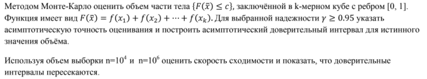

# **Вариант 19, Шевченко Валерий**

>Функция: $f(x)=\exp(-ax)$
>
>Размерность: $13$
>
>Параметр c: $2.9$
>
>Параметр a: $5.6$
>
>Параметр y: $0.97$

## Для $n = 10^4$:

>Объём: $p = 0.7639$
>
>Длина доверительного интервала: $\varDelta l=0.0092$
>
>Доверительный интервал: $\Big[0.7547,\quad 0.7731\Big]$

## Для $n=10^6$:

>Объём: $p = 0.7615$
>
>Длина доверительного интервала: $\varDelta l=0.0009$
>
>Доверительный интервал: $\Big[0.7606,\quad 0.7625\Big]$

## Вывод:
>Доверительные интерваллы пересекаются, и интервал для $n = 10^4$ включает интервал для $n = 10^6$. 
>
>При увеличении значения $n$, уменьшается доверительный интервал, то есть увеличивается точность.