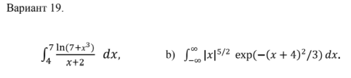

# **Вариант 19, Шевченко Валерий**

## 1. Интеграл вида $\int^b_ag(x)dx$

### Для $n = 10^4$

> $I1 = 2.0559$
>  
> $dI1 = 0.0013$
>  
> $In = \bigg[2.0547,\quad 2.0572\bigg]$

### Для $n = 10^6$

> $I1 = 2.0557$
>  
> $dI1 = 0.0001$
>  
> $In = \bigg[2.0556,\quad 2.0559\bigg]$

### $Ireal = 2.0557$

> Реальное значение лежит внутри доверительных интегралов. При увеличении $n$ в 100 раз, точность увеличилась в 10 раз (то есть в $\sqrt{n}$ раз).

## 2. Интеграл вида $\int^{\infty}_0g(x)e^{-\frac{x}{4}}dx$

### Для $n = 10^4$

> $I1 = 115.86$
>  
> $dI1 = 1.8989$
>  
> $In = \bigg[113.96,\quad 117.76\bigg]$

### Для $n = 10^6$

> $I1 = 115.35$
>  
> $dI1 = 0.1897$
>  
> $In = \bigg[115.16,\quad 115.54\bigg]$

### $Ireal = 115.40$

> Реальное значение лежит внутри доверительных интегралов. При увеличении $n$ в 100 раз, точность увеличилась в 10 раз (то есть в $\sqrt{n}$ раз).
