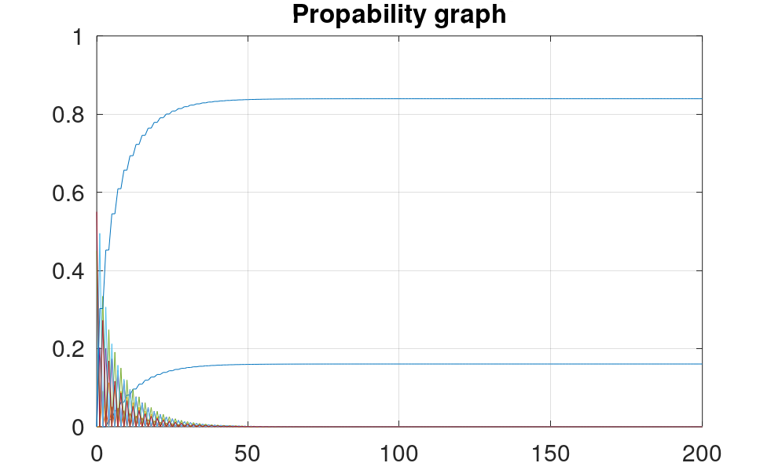
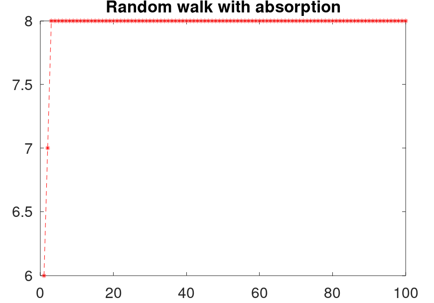

# Шевченко Валерий

## **Случайное блуждание с поглащением**

### **Исходные данные**

$N = 8$

$p = 0.55$

$q = 1 - p = 0.45$

$\quad$

### **Матрица $P$**

| | | | | | | | |
| --- | --- | --- | --- | --- | --- | --- | --- |
| $1.00$ | $0$ | $0$ | $0$ | $0$ | $0$ | $0$ | $0$ |
| $0.45$ | $0$ | $0.55$ | $0$ | $0$ | $0$ | $0$ | $0$ |
| $0$ | $0.45$ | $0$ | $0.55$ | $0$ | $0$ | $0$ | $0$ |
| $0$ | $0$ | $0.45$ | $0$ | $0.55$ | $0$ | $0$ | $0$ |
| $0$ | $0$ | $0$ | $0.45$ | $0$ | $0.55$ | $0$ | $0$ |
| $0$ | $0$ | $0$ | $0$ | $0.45$ | $0$ | $0.55$ | $0$ |
| $0$ | $0$ | $0$ | $0$ | $0$ | $0.45$ | $0$ | $0.55$ |
| $0$ | $0$ | $0$ | $0$ | $0$ | $0$ | $0$ | $1.00$ |

$\quad$

### **Вектор $p_0$**

$\big[ 0, \quad 0, \quad 0.7488, \quad 0.0386, \quad 0.1163, \quad 0.0963, \quad 0, \quad 0 \big]$

$\quad$

### **Теоритические предельные вероятности**

$\big[ 0.1606, \quad 0.8394 \big]$

$\quad$

### **Практические предельные вероятности**

$\big[ 0.1606, \quad 0.8394 \big]$

$\quad$

### **График изменения вероятности**

### **Начальная точка**

$Start = 6$

### **Случайное блуждание с поглащением**

### **Итог**

- Теоритические и практические вероятности совпали.
- Случайное блуждание с поглащением смоделировано.
