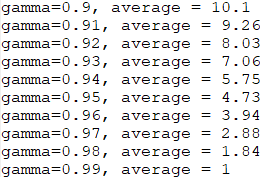

# Шевченко Валерий

## Введённые параметры

> $m = 10^2$
>
> $n = 10^4$
>
> $\gamma = 0.95$
>
> $t_0 = 0.75$
>
> $u = 1.5$
>
> $\sigma = 1$
>
> $\mu = 0$

## Нормальное распределение

Сравнение $\gamma$ и среднего количества интервалов, в которое не попало $F_x(t_0)$:

## Показательное распределение

Сравнение $\gamma$ и среднего количества интервалов, в которое не попало $F_x(t_0)$:

## Выводы

Число доверительных интервалов, в которые не попало $F_x(t_0)$ примерно равно $10^2 \cdot (1-\gamma)$. Число таких интервалов уменьшается с увеличеснием $\gamma$.
