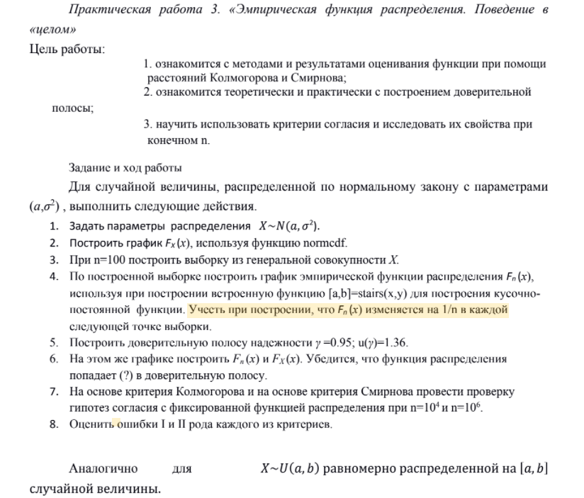
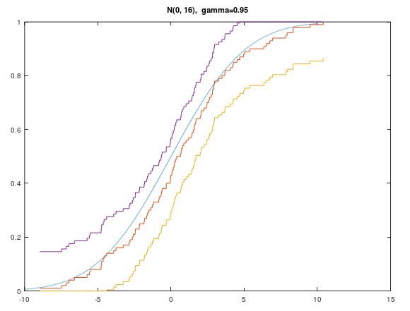
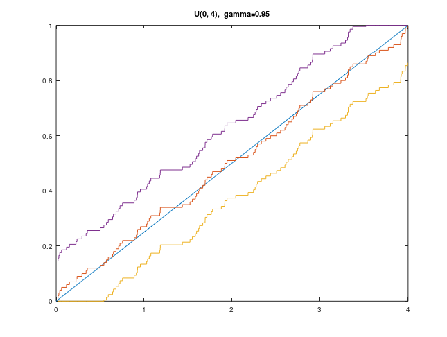

# Шевченко Валерий

## **Нормальное распределение N(0, 16)**

Функция распределения действительно находится внутри доверительной полосы.

### **Проверка критериев для нормального распределения N(0, 16)**

>**Критерий Колмогорова:**
>
>При $n = 10^4: 1.1668$
>
>При $n = 10^6: 0.8348$

>**Критерий Смирнова:**
>
>При $n = 10^4: 0.3288$
>
>При $n = 10^6: 0.0882$

Во всех случаях критерии меньше квантилей, значит гипотеза выполняется.

### **Вероятности ошибок для нормального распределения N(0, 16)**

>**I-ого рода, критерий Колмогорова:**
>
>При $n = 10^4: 0.02$
>
>При $n = 10^6: 0.03$

>**I-ого рода, критерий Смирнова:**
>
>При $n = 10^4: 0.02$
>
>При $n = 10^6: 0.01$

>**II-ого рода, критерий Колмогорова:**
>
>При $n = 10^4: 0.51$
>
>При $n = 10^6: 0$

>**II-ого рода, критерий Смирнова:**
>
>При $n = 10^4: 0.42$
>
>При $n = 10^6: 0$

При увеличении n, вероятность ошибки I-ого рода стремится к $1 - \gamma$.

При увеличении n, вероятность ошибки II-ого рода стремится к $0$.

## **Равномерное распределение U(0, 4)**

Функция распределения действительно находится внутри доверительной полосы.

### **Проверка критериев для равномерно распредления U(0, 4)**

>**Критерий Колмогорова:**
>
>При $n = 10^4: 1.2799$
>
>При $n = 10^6: 0.6753$

>**Критерий Смирнова:**
>
>При $n = 10^4: 0.3492$
>
>При $n = 10^6: 0.0782$

Во всех случаях критерии меньше квантилей, значит гипотеза выполняется.

### **Вероятности ошибок для равномерно распредления U(0, 4)**

>**I-ого рода, критерий Колмогорова:**
>
>При $n = 10^4: 0.06$
>
>При $n = 10^6: 0.04$

>**I-ого рода, критерий Смирнова:**
>
>При $n = 10^4: 0.05$
>
>При $n = 10^6: 0.04$

>**II-ого рода, критерий Колмогорова:**
>
>При $n = 10^4: 0$
>
>При $n = 10^6: 0$

>**II-ого рода, критерий Смирнова:**
>
>При $n = 10^4: 0$
>
>При $n = 10^6: 0$

При увеличении n, вероятность ошибки I-ого рода стремится к $1 - \gamma$.

При увеличении n, вероятность ошибки II-ого рода стремится к $0$.
