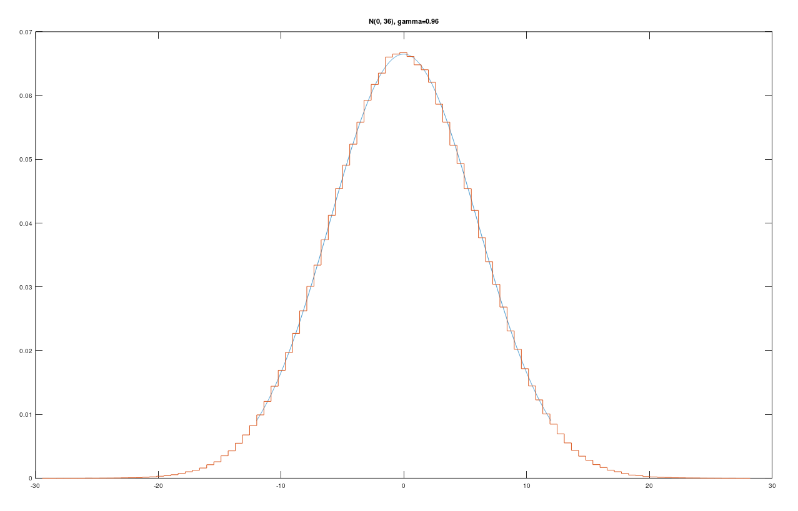
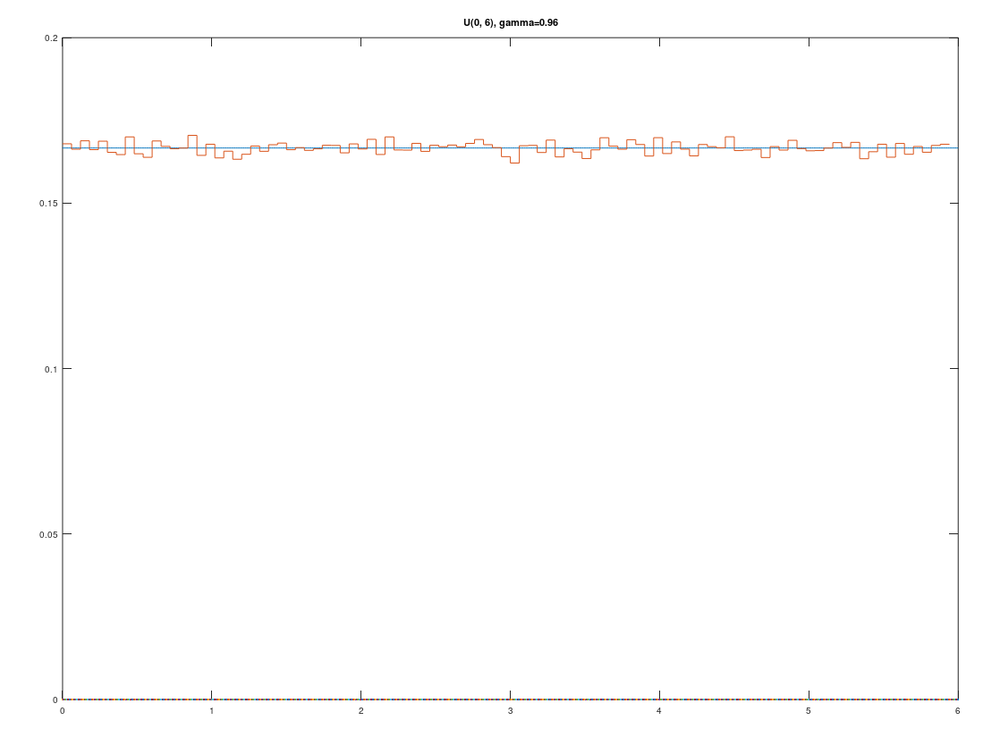

# Шевченко Валерий

## **Нормальное распределение N(0, 36)**

>**Критерий и ошибки:**
>| $\gamma$ | $\chi^2$ | Пороговое значение | Результат |
>| --- | --- | --- | --- |
>| $0.90$ | $92.558$ | $103.177$ | $1$ |
>| $0.95$ | $90.454$ | $108.647$ | $1$ |
>| $0.99$ | $102.837$ | $120.591$ | $1$ |

>**Ошибки 1-ого рода при $n = 10^6$:**
>| $\gamma$ | Вероятность |
>| --- | --- |
>| $0.90$ | $0.14$ |
>| $0.95$ | $0.08$ |
>| $0.99$ | $0.03$ |

>**Ошибки 2-ого рода при $n = 10^6$ и $\gamma = 0.95$:**
>| $\delta$ | Вероятность |
>| --- | --- |
>| $0.01$ | $0.61$ |
>| $0.02$ | $0.00$ |
>| $0.03$ | $0.00$ |

## **Равномерное распределение U(0, 6)**

>**Критерий и ошибки:**
>| $\gamma$ | $\chi^2$ | Пороговое значение | Результат |
>| --- | --- | --- | --- |
>| $0.90$ | $124.483$ | $115.223$ | $0$ |
>| $0.95$ | $87.814$ | $120.990$ | $1$ |
>| $0.99$ | $99.627$ | $132.309$ | $1$ |

>**Ошибки 1-ого рода при $n = 10^6$:**
>| $\gamma$ | Вероятность |
>| --- | --- |
>| $0.90$ | $0.13$ |
>| $0.95$ | $0.05$ |
>| $0.99$ | $0.02$ |

>**Ошибки 2-ого рода при $n = 10^6$ и $\gamma = 0.95$:**
>| $\delta$ | Вероятность |
>| --- | --- |
>| $0.1$ | $0.85$ |
>| $0.2$ | $0.34$ |
>| $0.3$ | $0.00$ |

## **Вывод**

Мы убедились, что вероятность ошибки первого рода примерно равна $1-\gamma$, а вероятность ошибки второго рода стремится к $0$ при увеличении сдвига. Исходя из этого можно сделать вывод, что квадрат критерия Пирсона является состоятельным критерием ассимптотического уровня значимости.
