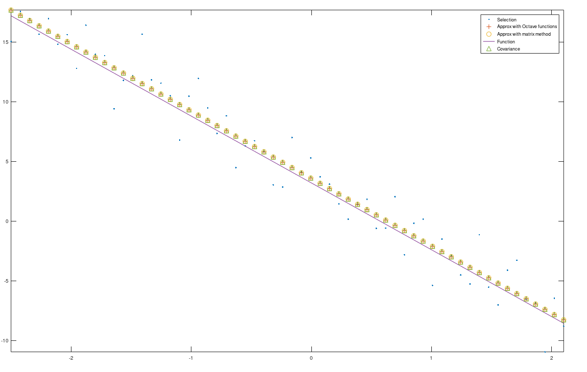

# Вариант 19, Шевченко Валерий

## Исходные данные

> Линейная функция: $y = -5.6x + 3.2$
>
> Линейная функция: $y = -6.8x^2 - 4.4x + 2.8$
>
> Границы интервала: $[-2.5, \quad 2.1]$
>
> Число точек: $60$
>
> Уровень шумов: $1.6$

## Линейная функция

| Исходные параметры | Матричный метод (встроенный) | Матричный метод (собственный) | Ковариация |
| --- | --- | --- | --- |
| $-5.600$ | $-5.703$ | $-5.703$ | $-5.703$ |
| $3.200$ | $2.990$ | $2.990$ | $2.990$ |

> Ортогональность: $1.13929 e^{-12}$
>
> Уровень шума: $1.36683$

## Квадратичная функция

| Исходные параметры | Матричный метод (встроенный) | Матричный метод (собственный)
| --- | --- | --- |
| $-6.8$ | $-6.836$ | $-6.836$ |
| $-4.4$ | $-4.274$ | $-4.274$ |
| $2.8$ | $2.811$ | $2.811$ |

> Ортогональность: $4.85895e^{-12}$
>
> Уровень шума: $1.49487$

## Вывод

- Найденные параметры квадратиной и линейной функций почти равны исходным.
- Результаты полученные встроенным методом равны результатам собсвенного матричного метода в обоих случаях.
- Ортогональность в обоих функциях примерно равна 0.
- Полученная оценка уровня шума близка к данному значению.
