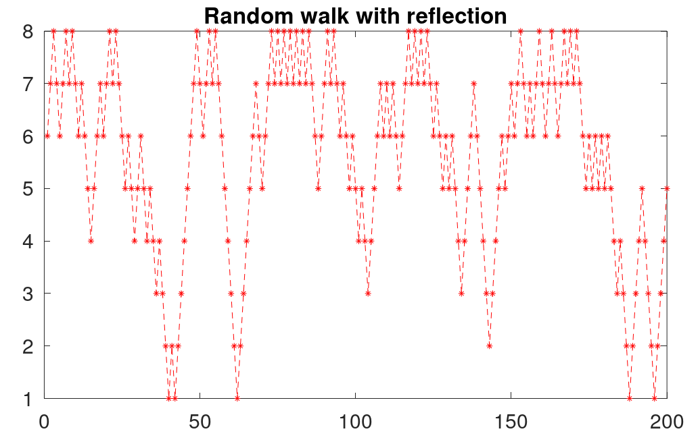

# Шевченко Валерий

## **Случайное блуждание с отражением**

### **Исходные данные**

$N = 8$

$p = 0.55$

$q = 1 - p = 0.45$

$\quad$

### **Матрица $P$**

| | | | | | | | |
| --- | --- | --- | --- | --- | --- | --- | --- |
| $0.45$ | $0.55$ | $0$ | $0$ | $0$ | $0$ | $0$ | $0$ |
| $0.45$ | $0$ | $0.55$ | $0$ | $0$ | $0$ | $0$ | $0$ |
| $0$ | $0.45$ | $0$ | $0.55$ | $0$ | $0$ | $0$ | $0$ |
| $0$ | $0$ | $0.45$ | $0$ | $0.55$ | $0$ | $0$ | $0$ |
| $0$ | $0$ | $0$ | $0.45$ | $0$ | $0.55$ | $0$ | $0$ |
| $0$ | $0$ | $0$ | $0$ | $0.45$ | $0$ | $0.55$ | $0$ |
| $0$ | $0$ | $0$ | $0$ | $0$ | $0.45$ | $0$ | $0.55$ |
| $0$ | $0$ | $0$ | $0$ | $0$ | $0$ | $0.45$ | $0.55$ |

$\quad$

### **Вектор $p_0$**

$\big[ 0, \quad 0, \quad 0.4836, \quad 0.3881, \quad 0.0538, \quad 0.0745, \quad 0, \quad 0 \big]$

$\quad$

### **Теоритические вероятности**

$\big[ 0.0558, \quad 0.0682, \quad 0.0834, \quad 0.1020, \quad 0.1246, \quad 0.1523, \quad 0.1861, \quad 0.2275 \big]$

$\quad$

### **Практические вероятности**

$\big[ 0.0558, \quad 0.0682, \quad 0.0834, \quad 0.1020, \quad 0.1246, \quad 0.1523, \quad 0.1861, \quad 0.2275 \big]$

$\quad$

### **График изменения вероятности**

### **Случайное блуждание с отражением**

### **Итог**

- Теоритические и практические вроятности совпали.
- Случайное блуждание с отражением смоделировано.
